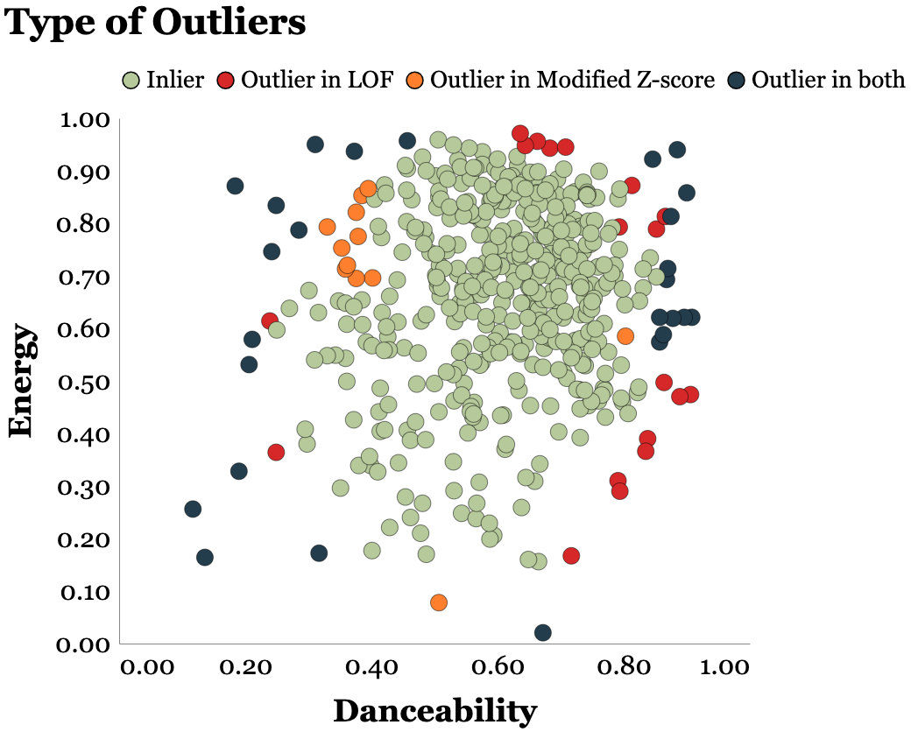
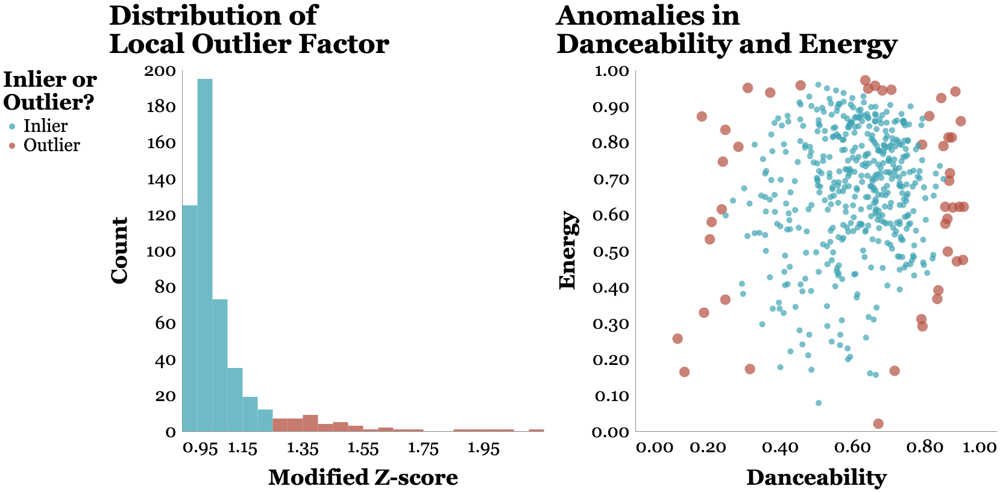

# Unsupervised Anomaly Detection on Spotify data :musical_note:: K-Means vs Local Outlier Factor
Anomaly detection is a crucial in any Data Science project. It's an important component during 
Exploratory Data Analysis and sometimes it's overlooked.

In this project I show the steps (methodology) that I followed for Anomaly Detection in my own personal 
Spotify data (only song features). I implemented a characterisation of the dataset with **K-Means algorithm** 
and parallely used Local Outlier Factor, to find the anomalies/outliers.

## What's in this repository
Here you can find the notebook where the anomaly detection analysis is performed 
([here](https://github.com/isaacarroyov/spotify_anomalies_kmeans-lof/blob/main/notebooks/Anomaly-Outlier_Detection_Spotify.ipynb))
and how I got the data ([here](https://github.com/isaacarroyov/spotify_anomalies_kmeans-lof/tree/main/scripts))

## Data Visualizations

